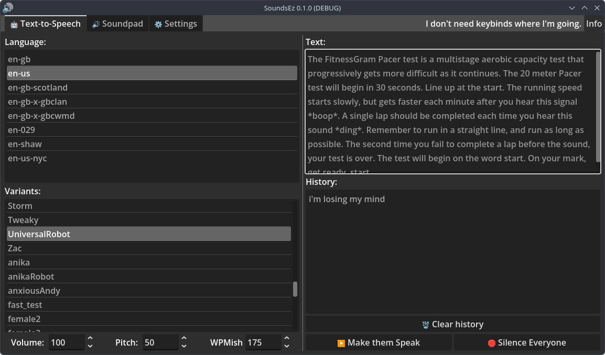
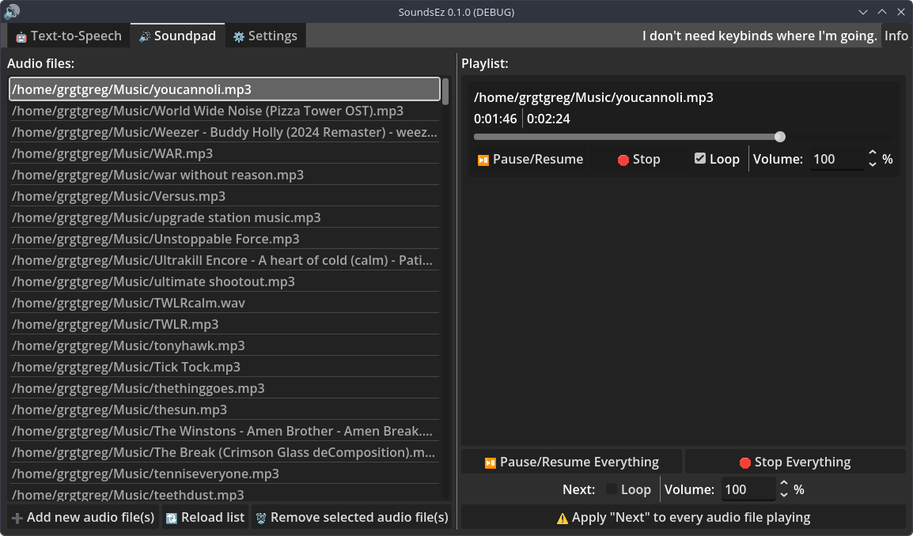

# 🔊 SoundsEz
FOS (Free and Open Source) AiO Solution for micspamming TTS and Sounds/Music

Inspired by Tarasov Aleksandr's [PipeWire Soundpad](https://github.com/arabianq/pipewire-soundpad) and Sebastian Macke's [Software Automatic Mouth](https://github.com/s-macke/SAM) (though this uses [espeak-ng](https://github.com/espeak-ng/espeak-ng))

itch.io link: https://greg0rygreg.itch.io/soundsez

Made with L❤️VE by G.T. Greg Games

# Features
- TTS
- Multiplatform (Linux, Windows)
- Sound management
- Light mode (for whoever)
- FitnessGram Pacer Test™ Transcription

# why?
Why NOT

# How 2 install
## Simple (pre-compiled binaries, unlatest but stablest)
1. Go to latest release
2. Download for your OS
3. done

## Advanced (compiling from source, latest but unstablest)
### Windows
NOT fully sure yet

### Linux
```sh
# you'll need to install godot and git using your package manager
git clone https://github.com/greg0rygreg/SoundsEz
cd SoundsEz
godot --export-release linux ./project.godot ../SoundsEz.zip
```

# Troubleshooting

## Windows
### VCRUNTIMEXXX errors
Install Visual C++ Redistributable (lastest worked for me (in a VM))

### 'espeak-ng not detected'
install it dude what are you doing

### 'no outputs detected'
Are you sure you can even hear what sounds/music you were about to put in SoundsEz

## Linux
### 'espeak-ng not detected'
install it dude what are you doing

### 'no outputs detected'
Are you sure you can even hear what sounds/music you were about to put in SoundsEz

# TODO
- [x] Make this readme pretty
- [ ] Fix some languages not being compatible with some variants
- [ ] Make settings tab pretty

# Screenies


